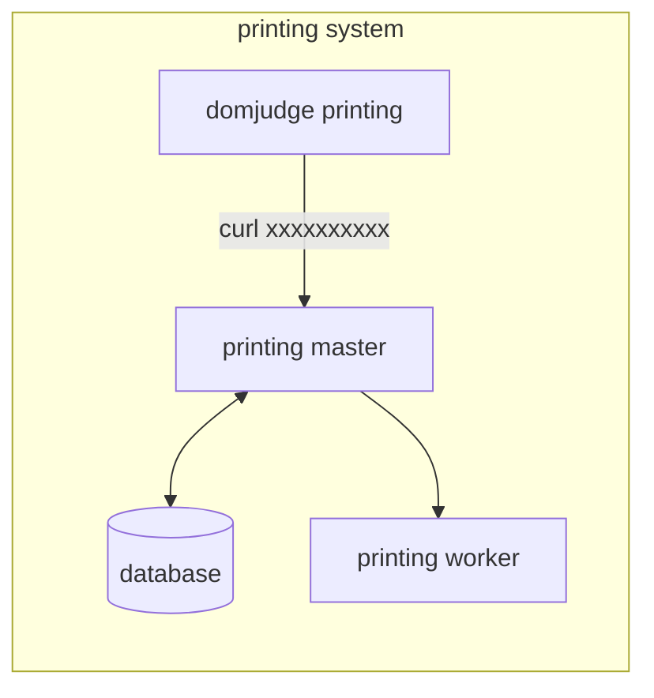

# DOMJUDGE BASED PRINTING MASTER

## System Architecture Diagram



## DOMjudge configuration

DOMjudge shells out to a configurable command whenever a team submits a print job. Set it in
**Admin → Configuration settings → Printing → `print_command`** (or in `etc/domserver-config.yaml`)
so that the source file is piped to this printing master:

```
cat [file] | curl -X POST "http://<printing-master-host>:<port>/print" -H "username: [username]" -H "teamname: [teamname]" -H "teamid: [teamid]" -H "location: [location]" --data-binary @-
```

Replace `<printing-master-host>:<port>` with the address the DOMjudge server can reach this service
on (the app listens on `PORT`, default `8080`). The bracketed tokens are DOMjudge placeholders and
are substituted by DOMjudge itself — leave them exactly as written:

| Placeholder | Meaning |
| --- | --- |
| `[file]` | Path to the temporary file holding the submitted source code |
| `[username]` | Login name of the team that requested the print |
| `[teamname]` | Display name of the team |
| `[teamid]` | Numeric team ID |
| `[location]` | Team's location / seat, as configured in DOMjudge |

The four headers map one-to-one onto what `POST /print` requires; all of them must be non-empty or
the request is rejected with 400. The request body is the raw source code and must be valid UTF-8
(max 32MB). On success the response is `200` with the job ID, worker ID, page count and stored file
name; a missing/failed worker yields `500`.

Quick manual test (no DOMjudge involved):

```
cat main.go | curl -X POST "http://<printing-master-host>:<port>/print" \
  -H "username: team01" \
  -H "teamname: Example Team" \
  -H "teamid: 1" \
  -H "location: A-12" \
  --data-binary @-
```

## Running

The printing master and its Postgres database run via Docker Compose. The printing worker(s) (the Python/FastAPI service in `spec.md`) run separately, on hosts with printer access.

```
docker compose up -d --build
```

Workers are managed via the API, which is the source of truth (the `workers` table):

- `POST /workers` `{"ip_address": "host:port"}` — save a worker IP to the database
- `GET /workers` — list saved workers
- `DELETE /workers/:id` — remove a worker (fails with 409 if it has print history)

Env vars (all optional, with defaults for local/compose use):

- `PORT` — app listen port (default `8080`)
- `DB_HOST`, `DB_PORT`, `DB_USER`, `DB_PASSWORD`, `DB_NAME`, `DB_SSLMODE` — Postgres connection (or set `DATABASE_DSN` directly)
- `STORAGE_DIR` — where generated PDFs are kept (default `./storage`, or `/app/storage` in the container)
- `APP_PORT` — host port mapped to the app (default `8080`)
- `POSTGRES_PORT` — host port mapped to Postgres (default `5432`), for connecting to the database from outside the compose network

