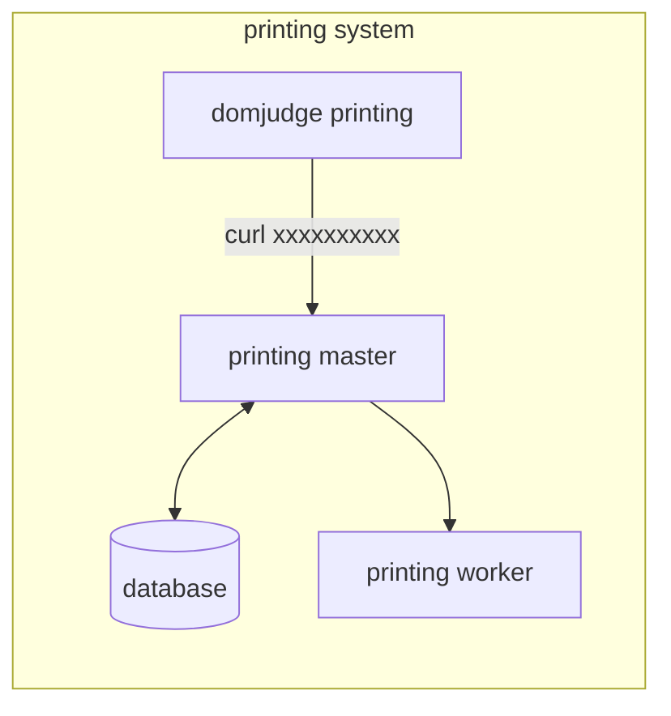

# DOMJUDGE BASED PRINTING MASTER

## System Architecture Diagram



## Running

The printing master and its Postgres database run via Docker Compose. The printing worker(s) (the Python/FastAPI service in `spec.md`) run separately, on hosts with printer access.

```
docker compose up -d --build
```

Workers are managed via the API, which is the source of truth (the `workers` table):

- `POST /workers` `{"ip_address": "host:port"}` — save a worker IP to the database
- `GET /workers` — list saved workers
- `DELETE /workers/:id` — remove a worker (fails with 409 if it has print history)

Env vars (all optional, with defaults for local/compose use):

- `PORT` — app listen port (default `8080`)
- `DB_HOST`, `DB_PORT`, `DB_USER`, `DB_PASSWORD`, `DB_NAME`, `DB_SSLMODE` — Postgres connection (or set `DATABASE_DSN` directly)
- `STORAGE_DIR` — where generated PDFs are kept (default `./storage`, or `/app/storage` in the container)
- `APP_PORT` — host port mapped to the app (default `8080`)
- `POSTGRES_PORT` — host port mapped to Postgres (default `5432`), for connecting to the database from outside the compose network

