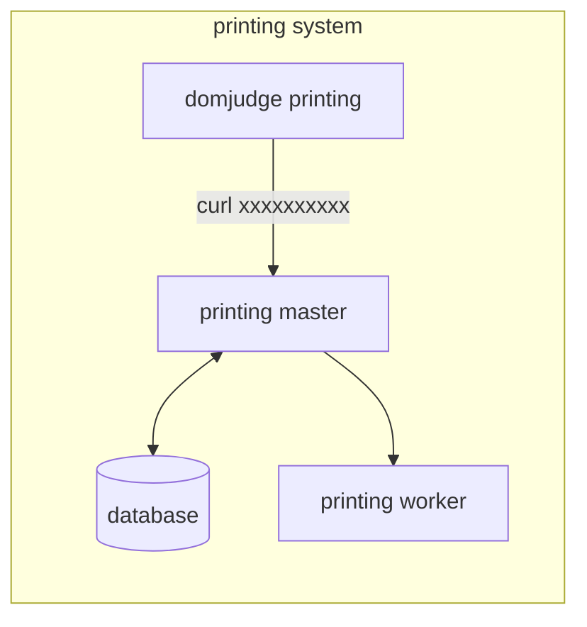

# DOMJUDGE BASED PRINTING MASTER

## System Architecture Diagram

```mermaid
flowchart LR
    subgraph "printing system"
        DJ[domjudge printing]
        PM[printing master]
        DB[(database)]
        PW[printing worker]

        DJ -->|curl xxxxxxxxxx| PM
        PM <--> DB
        PM --> PW
    end
```
